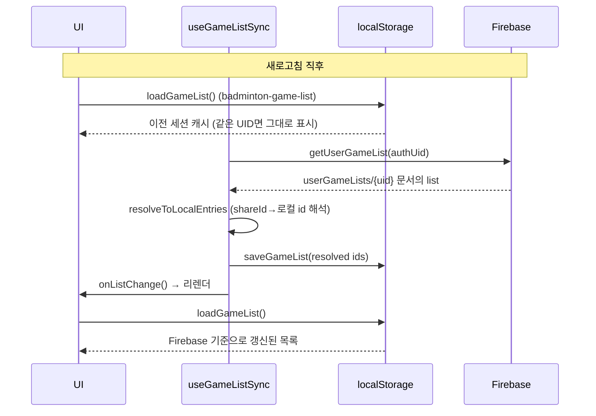

# 새로고침 시 경기 목록 소스 정리

이 문서는 새로고침 시 경기 목록이 어디서 오는지 데이터 소스와 흐름을 정리한 설명입니다. 코드 수정 없이 현재 동작만 명확히 합니다.

## 결론: **최종 소스는 Firebase, 화면은 localStorage를 읽음**

- **진짜 데이터 원천**: Firebase Firestore `userGameLists/{uid}` 문서 (해당 UID의 경기 목록).
- **화면이 읽는 곳**: **localStorage** 키 `badminton-game-list`. 이 값은 동기화 훅이 Firebase에서 가져와 덮어쓴 결과입니다.

즉, "올라오는 내용"은 **Firebase가 원본**이고, 앱은 그걸 로컬에 저장한 뒤 그 로컬을 UI 소스로 씁니다.

---

## 데이터 흐름 (새로고침 시)

- **1단계**: 첫 렌더에서 UI는 `loadGameList()`로 **localStorage**만 읽습니다. (계정 전환 시에만 비우도록 되어 있어, 새로고침 시에는 비우지 않아 같은 기기·같은 UID면 이전 목록이 잠깐 보일 수 있음.)
- **2단계**: [app/hooks/useGameListSync.ts](app/hooks/useGameListSync.ts)의 `useEffect`에서 `getUserGameList(authUid)`로 **Firebase `userGameLists/{uid}`**를 조회합니다.
- **3단계**: `applyServerList` → `resolveToLocalEntries`로 서버 항목을 로컬 id로 바꾼 뒤, `saveGameList(resolved)`로 **localStorage를 Firebase 기준으로 덮어씁니다.**
- **4단계**: `onListChange()`로 리렌더가 일어나고, UI는 다시 `loadGameList()`를 호출해 **이미 Firebase 기준으로 갱신된 localStorage**를 읽어서 화면에 냅니다.

따라서 "다시 올라오는 경기 목록"은 **Firebase `userGameLists/{uid}`를 소스로** 가져와서, 로컬에 반영한 뒤 그 로컬을 UI가 읽는 구조입니다.

---

## 참고: 관련 코드 위치

| 역할 | 파일 | 설명 |
|------|------|------|
| 경기 목록 ID 배열 저장/로드 | [lib/game-storage.ts](lib/game-storage.ts) | `loadGameList()` / `saveGameList()` — localStorage `badminton-game-list` |
| Firestore 경기 목록 조회/구독 | [lib/sync.ts](lib/sync.ts) | `getUserGameList(uid)`, `subscribeUserGameList(uid)` — 컬렉션 `userGameLists`, 문서 id = uid |
| 동기화 훅 (소스 적용) | [app/hooks/useGameListSync.ts](app/hooks/useGameListSync.ts) | `getUserGameList(authUid).then(applyServerList)` → `saveGameList` + `onListChange` |
| 화면 표시 | [app/page.tsx](app/page.tsx) | `loadGameList()`로 id 배열 읽고, 각 id로 `loadGame(id)` 해서 카드 렌더 |

---

이 동작을 바꾸고 싶다면 (예: "Firebase 응답 올 때까지 로딩만 보이게" 등) 별도 요구사항에 맞춰 수정할 수 있습니다.
