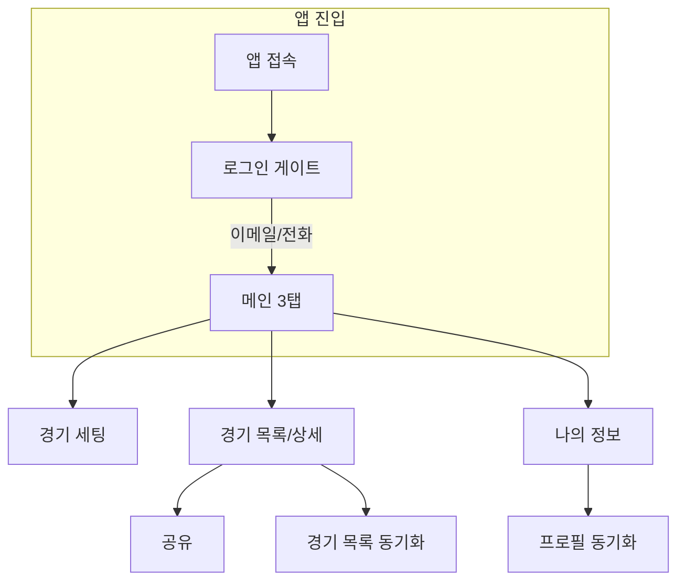
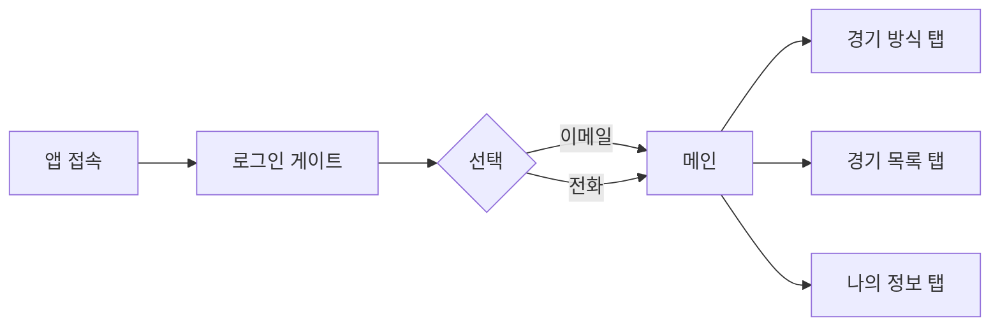
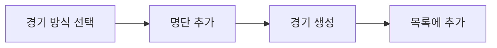
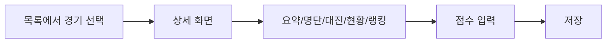
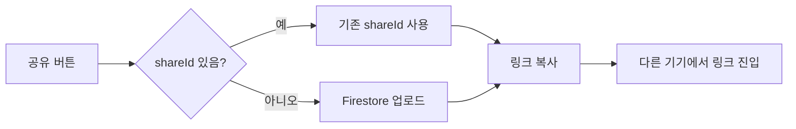
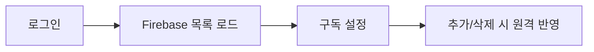
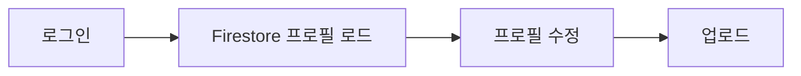
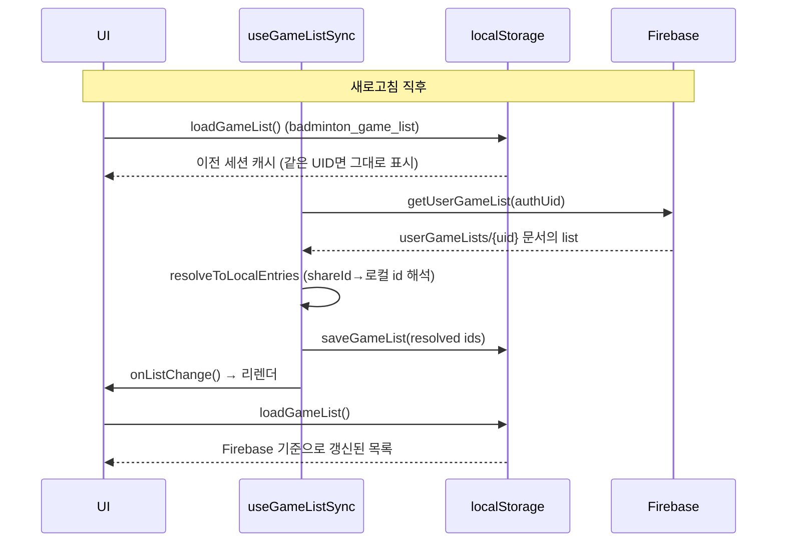

# 배드민턴 경기 관리 앱 — 문서

이 문서는 **사용자 운영 시나리오**를 기준으로, 프로젝트 구조, Firebase 설정, 경기 목록 동기화를 한 곳에서 관리합니다.

---

## 목차

1. [프로젝트 소개 및 실행](#1-프로젝트-소개-및-실행)
2. [사용자 운영 시나리오](#2-사용자-운영-시나리오)
3. [프로젝트 구조](#3-프로젝트-구조)
4. [Firebase 설정](#4-firebase-설정)
5. [경기 목록 동기화](#5-경기-목록-동기화)
6. [구조 이해 및 개선 제안](#6-구조-이해-및-개선-제안)

---

## 1. 프로젝트 소개 및 실행

배드민턴 경기 관리 앱(Next.js)입니다. 경기 방식 선택, 명단·대진 관리, 경기 결과 입력·랭킹, 공유 링크(Firestore), 이메일/전화번호 로그인·경기 목록·프로필 동기화를 지원합니다.

**제품 방향**
- **모든 경기는 서버(Firestore)에 저장**: 경기 생성/목록 추가 시 항상 Firestore(sharedGames)에 저장됩니다. 로컬 전용(shareId 없음) 경기는 없습니다.
- **오프라인 동작 미지원**: 네트워크가 없으면 경기 생성·저장·공유·삭제 등 쓰기가 차단되며, "오프라인입니다. 네트워크가 필요합니다." 배너가 표시됩니다.
- **로그인 필수**: 로그인 게이트 통과 후에만 경기 세팅·경기 목록·나의 정보 등 관련 기능을 사용할 수 있습니다.

**기술 스택**: Next.js, React, TypeScript, Firebase (Auth, Firestore)

### 실행 방법

```bash
npm install
npm run dev
```

브라우저에서 [http://localhost:3000](http://localhost:3000) 접속.

Firebase(경기 공유·로그인·경기 목록 동기화)를 사용하려면 [Firebase 설정](#4-firebase-설정)을 참고해 `.env.local`에 환경 변수를 넣은 뒤 서버를 재시작하세요.

---

## 2. 사용자 운영 시나리오

**사용자 운영 시나리오는 이 문서의 기준**입니다. 프로젝트 구조(3), Firebase 설정(4), 경기 목록 동기화(5), 구조 이해 및 개선 제안(6)은 모두 이 시나리오를 전제로 합니다. 각 시나리오별 **조작 순서**는 아래 순서도로 확인할 수 있습니다.

### 전체 흐름



### 시나리오 요약 표

| 시나리오 | 흐름 | 관련 코드 |
|----------|------|-----------|
| 앱 진입·로그인 | 로그인 게이트(이메일/전화) → 메인(경기 방식·경기 목록·나의 정보 탭) | page.tsx 로그인 게이트, onAuthStateChanged, 나의 정보 탭 |
| 경기 세팅 | 경기 방식 선택 → 명단 추가 → 경기 생성 → 목록에 추가 | page.tsx 경기 방식 섹션, AddMemberForm, doMatch, addGameToRecord |
| 경기 목록·상세 | 목록에서 경기 선택 → 상세(요약·명단·대진·경기 현황·랭킹) → 점수 입력·저장 | page.tsx record 섹션, loadGameList/loadGame, saveResult |
| 공유 | 공유 버튼 → Firestore 업로드/기존 shareId 사용 → 링크 복사 → 다른 기기에서 링크로 진입 | handleShareCard, processShareAndOpenDetail, subscribeSharedGame |
| 경기 목록 동기화 | 로그인 후 목록을 Firebase에서 로드·구독 → 추가/삭제 시 원격 반영 | useGameListSync, getUserGameList, subscribeUserGameList |
| 프로필 동기화 | 로그인 시 Firestore에서 프로필 로드 → 수정 후 업로드 | getRemoteProfile, setRemoteProfile, uploadProfileToFirestore |

아래는 각 시나리오별 **조작 순서**를 순서도로 상세히 나타낸 것입니다.

### 앱 진입·로그인

앱 접속 후 로그인 게이트에서 이메일 또는 전화로 로그인하면 메인(경기 방식·경기 목록·나의 정보 탭)으로 진입합니다.



### 경기 세팅

경기 방식 선택 → 명단 추가 → 경기 생성 → 목록에 추가 순서로 진행합니다.



### 경기 목록·상세

목록에서 경기를 선택하면 상세 화면(요약·명단·대진·경기 현황·랭킹)이 열리고, 점수 입력 후 저장합니다.

- **만든이 권한**: 경기 요약(이름·날짜·시간·장소·승점)은 **만든이(createdByUid와 일치하는 사용자)만 수정 가능**합니다.



### 공유

공유 버튼 클릭 시 기존 shareId가 있으면 재사용, 없으면 Firestore에 업로드한 뒤 링크를 복사하고, 다른 기기에서 해당 링크로 진입할 수 있습니다.



### 경기 목록 동기화

로그인 후 Firebase에서 경기 목록을 로드·구독하고, 추가/삭제 시 원격에 반영됩니다.



### 프로필 동기화

로그인 시 Firestore에서 프로필을 로드하고, 수정 후 업로드하면 다른 기기에서 동일 프로필을 사용할 수 있습니다.



---

## 3. 프로젝트 구조

배드민턴 경기 관리 앱의 디렉터리·역할 정리.

### 3.1 탐색기 항목별 최하위 경로 및 역할

왼쪽 탐색기(Explorer)에 보이는 항목별로, 최하위 경로/문서와 그 역할을 정리한 표입니다.

| 탐색기 항목 | 최하위 경로 / 문서 | 역할 (상세 설명) |
|-------------|--------------------|------------------|
| **.next** | (빌드 생성 디렉터리 전체) | `next build` / `next dev` 시 생성되는 출력·캐시. 최적화된 JS/CSS 번들, SSR 결과, 라우트 매니페스트 등이 들어 있으며, Git 추적 대상이 아님. |
| **app** | (App Router 루트) | Next.js App Router의 핵심 디렉터리. 라우트(페이지), 레이아웃, 공통/클라이언트 컴포넌트 등 대부분의 앱 소스가 위치함. |
| **app/components** | (공통 UI 컴포넌트들) | 앱 전역에서 재사용하는 UI 컴포넌트(버튼, 폼, 아이콘, PWA 설치 유도 등)를 모아둔 폴더. |
| **app/components/AddMemberForm.tsx** | `app/components/AddMemberForm.tsx` | 명단 추가용 폼 컴포넌트. 이름·등급 입력 및 추가 버튼. |
| **app/components/PwaInstallPrompt.tsx** | `app/components/PwaInstallPrompt.tsx` | PWA 설치 유도 배너·모달. “홈 화면에 추가” 버튼, Chrome 설치 프롬프트 연동, iOS/수동 설치 안내. |
| **app/components/category-icons.tsx** | `app/components/category-icons.tsx` | 경기 방식 카테고리(복식·단식·대항전·단체 등) 아이콘 컴포넌트. |
| **app/components/nav-icons.tsx** | `app/components/nav-icons.tsx` | 하단 탭(경기 방식·경기 목록·경기 이사) 아이콘 컴포넌트. |
| **app/game** | (경기 라우트 폴더) | 경기(게임) 상세 라우트를 위한 디렉터리. |
| **app/game/[id]/page.tsx** | `app/game/[id]/page.tsx` | 동적 경기 상세 페이지. `/game/[id]` 진입 시 해당 경기 데이터로 GameView 렌더. |
| **app/hooks** | (훅 폴더) | 재사용 가능한 커스텀 React 훅 정의. |
| **app/hooks/useGameListSync.ts** | `app/hooks/useGameListSync.ts` | 로그인 UID 기준 경기 목록 Firestore 동기화. 구독·병합·업로드 로직 캡슐화. |
| **app/icons** | (아이콘 라우트 폴더) | 아이콘 관련 라우트·페이지. |
| **app/icons/page.tsx** | `app/icons/page.tsx` | 아이콘 목록/테스트용 페이지. |
| **app/login** | (로그인 라우트 폴더) | 로그인·회원가입 전용 라우트. |
| **app/login/page.tsx** | `app/login/page.tsx` | 로그인 전용 페이지. 현재는 `/`로 리다이렉트하며, 실제 로그인 UI는 메인 “나의 정보”에 있음. |
| **app/constants.ts** | `app/constants.ts` | 앱 전역 상수. PRIMARY, PRIMARY_LIGHT, LOGIN_GATE_KEY, NAV_ORDER, NavView 타입 등. |
| **app/favicon.ico** | `app/favicon.ico` | 웹사이트 파비콘. 브라우저 탭·북마크에 표시되는 아이콘. |
| **app/globals.css** | `app/globals.css` | 전역 CSS. Tailwind 기반 스타일, 유틸 클래스, 키프레임(애니메이션) 등. |
| **app/layout.tsx** | `app/layout.tsx` | 루트 레이아웃. HTML/body, 메타 태그, PWA 관련 메타, 폰트, PwaInstallPrompt 등 모든 페이지 공통 UI. |
| **app/manifest.ts** | `app/manifest.ts` | PWA 웹 매니페스트. 앱 이름·아이콘·시작 URL·display(standalone) 등 설치형 앱 설정. |
| **app/page.tsx** | `app/page.tsx` | 메인 페이지. Home → GameView 한 컴포넌트에 경기 세팅·목록·나의 정보 탭 및 상세 UI·상태·로직이 집중됨. |
| **app/types.ts** | `app/types.ts` | 앱 내 공통 타입. Member, Match, Team, GameMode, Grade 등. |
| **docs** | (문서 폴더) | 프로젝트 문서 전용 폴더. |
| **docs/README.md** | `docs/README.md` | 통합 문서. 프로젝트 구조, Firebase 설정, 경기 목록 동기화, 사용자 시나리오·개선 제안 등 전체 설명. |
| **lib** | (라이브러리 루트) | app과 분리된 공통 유틸·서비스·비즈니스 로직. |
| **lib/firebase.ts** | `lib/firebase.ts` | Firebase 앱·Auth·Firestore 초기화, getDb, getAuthInstance, ensureFirebase 등. |
| **lib/game-logic.ts** | `lib/game-logic.ts` | 경기 방식 설정(GAME_MODES, TARGET_TOTAL_GAMES_TABLE, GRADE_ORDER), 대진 생성(buildRoundRobinMatches, generateMatchesByGameMode, getTargetTotalGames). |
| **lib/game-mode-utils.ts** | `lib/game-mode-utils.ts` | 시간/코트/포맷 유틸(TIME_OPTIONS_30MIN, createId, formatSavedAt, formatEstimatedDuration, canUseParallelCourts 등), game-logic 일부 re-export. |
| **lib/game-share.ts** | `lib/game-share.ts` | 공유 링크용 직렬화·복원(encodeGameForShare, decodeGameFromShare). |
| **lib/game-storage.ts** | `lib/game-storage.ts` | 로컬 저장. loadGame, saveGame, loadGameList, saveGameList, addGameToList, removeGameFromList, loadMyInfo, saveMyInfo. |
| **lib/match-stats.ts** | `lib/match-stats.ts` | 승패·득실차 계산(recomputeMemberStatsFromMatches, buildRankingFromMatchesOnly). |
| **lib/sync.ts** | `lib/sync.ts` | Firestore 공유. sharedGames·userGameLists: getSharedGame, setSharedGame, subscribeSharedGame, getUserGameList, setUserGameList, subscribeUserGameList. |
| **lib/profile-sync.ts** | `lib/profile-sync.ts` | 로그인 UID 기준 프로필 원격 조회·저장(getRemoteProfile, setRemoteProfile). |
| **lib/email-auth.ts** | `lib/email-auth.ts` | 이메일 로그인·회원가입·인증(signIn, signUp, sendVerification, subscribeEmailAuthState 등). |
| **lib/phone-auth.ts** | `lib/phone-auth.ts` | 전화번호 로그인(startPhoneAuth, confirmPhoneCode, getCurrentPhoneUser 등). |
| **node_modules** | (패키지 디렉터리) | `npm install`로 설치된 외부 패키지. Git 추적 대상 아님. |
| **public** | (정적 파일 루트) | 빌드 없이 그대로 서비스되는 정적 파일(이미지, HTML, 검증 파일 등). |
| **public/file.svg** | `public/file.svg` | 정적 SVG 아이콘/이미지. |
| **public/privacy.html** | `public/privacy.html` | 개인정보 처리 방침 등 정적 HTML. |
| **public/vercel.svg** | `public/vercel.svg` | Vercel 관련 정적 이미지. |
| **public/window.svg** | `public/window.svg` | 윈도우/앱 관련 정적 SVG. |
| **public/google265835da0424a401.html** | `public/google265835da0424a401.html` | Google 검색/소유권 검증용 HTML. |
| **.editorconfig** | `.editorconfig` | 에디터 공통 설정. 들여쓰기, 인코딩, 줄 끝 등으로 팀 코딩 스타일 통일. |
| **.env.example** | `.env.example` | 환경 변수 예시. `.env.local` 복사 시 참고하는 Firebase 등 설정 템플릿. |
| **.env.local** | `.env.local` | 로컬 환경 변수(Firebase API 키 등). Git 제외, 실제 값 보관. |
| **.gitignore** | `.gitignore` | Git이 무시할 파일·폴더(.next, node_modules, .env.local 등). |
| **eslint.config.mjs** | `eslint.config.mjs` | ESLint 규칙·설정. 코드 품질·스타일 검사. |
| **firestore.rules.example** | `firestore.rules.example` | Firestore 보안 규칙 예시. sharedGames, users, userGameLists 등 접근 제어 참고용. |
| **next-env.d.ts** | `next-env.d.ts` | Next.js 관련 TypeScript 전역 타입 선언. |
| **next.config.ts** | `next.config.ts` | Next.js 설정. 빌드, 이미지, 환경 변수, 라우팅 등. |
| **package-lock.json** | `package-lock.json` | 의존성 잠금. npm 설치 시 동일 버전 보장. |
| **package.json** | `package.json` | 프로젝트 메타·스크립트(dev, build 등)·직접 의존성 목록. |
| **postcss.config.mjs** | `postcss.config.mjs` | PostCSS 설정. Tailwind 등 CSS 변환 플러그인. |
| **README.md** | `README.md` | 루트 README. 프로젝트 소개·실행 방법·docs/README.md 링크. |
| **tsconfig.json** | `tsconfig.json` | TypeScript 컴파일 설정. 대상, 모듈, 경로 별칭(@/ 등). |

### 3.2 폴더·항목별 사용 여부·중복 검토 및 정리 방향

아래 표는 각 폴더·파일의 **실제 사용 여부**, **중복 여부**를 검토한 뒤, **정리 방향**을 제안한 것입니다.

| 구분 | 경로/항목 | 사용 유무 | 중복 유무 | 비고 |
|------|-----------|-----------|-----------|------|
| **빌드/캐시** | `.next` | 사용(자동 생성) | — | Git 제외, 유지. |
| **앱 루트** | `app` | 사용 | — | 핵심 소스. |
| **app** | `app/components/AddMemberForm.tsx` | 사용 | — | `page.tsx`에서 import하여 사용. |
| **app** | `app/components/PwaInstallPrompt.tsx` | 사용 | — | `layout.tsx`에서 사용. |
| **app** | `app/components/category-icons.tsx` | 사용 | — | `page.tsx`에서 카테고리 아이콘으로 사용. |
| **app** | `app/components/nav-icons.tsx` | 사용 | — | `page.tsx`에서 하단 탭 아이콘으로 사용. |
| **app** | `app/game/[id]/page.tsx` | 사용 | — | `/game/[id]` 라우트, `GameView`만 사용. |
| **app** | `app/hooks/useGameListSync.ts` | 사용 | — | `page.tsx`에서 경기 목록 Firestore 동기화에 사용. |
| **app** | `app/icons/page.tsx` | **간접 사용** | — | `/icons` 라우트만 존재. 앱 내 링크는 없음. 개발/디자인용 미리보기 페이지. |
| **app** | `app/login/page.tsx` | 사용 | — | `/login` 진입 시 `/`로 리다이렉트. 실제 로그인 UI는 메인에 있음. |
| **app** | `app/constants.ts`, `types.ts`, `layout.tsx`, `page.tsx`, `manifest.ts`, `globals.css`, `favicon.ico` | 사용 | — | 유지. |
| **문서** | `docs`, `docs/README.md` | 사용 | — | 통합 문서. 유지. |
| **lib** | `lib/firebase.ts`, `game-storage.ts`, `sync.ts`, `game-share.ts`, `match-stats.ts`, `game-logic.ts`, `game-mode-utils.ts`, `profile-sync.ts`, `email-auth.ts`, `phone-auth.ts` | 사용 | — | 핵심 로직. `page.tsx`는 여기서 import하여 사용. |
| **기타** | `node_modules`, `public/*` | 사용 또는 정적 자산 | — | 유지. |
| **설정** | 루트 설정 파일들 | 사용 | — | 유지. |

**정리 적용 이력 (누적)**  
전혀 사용되지 않는 항목만 삭제 후 `npm run build`로 검증함.  
삭제: `lib/inquiry.ts`, `app/components/profile-badge.tsx`, `app/components/panels/*`, AppNav, GameViewHeader, HelpModals, RegenerateConfirmModal, ShareToast, `app/contexts/GameViewContext.tsx`, 빈 폴더 `app/contexts`, `app/auth`, `src`, `utils`.

**정리 방향 제안 (참고용)**

1. **미사용·빈 폴더**
   - **app/auth**: 인증을 별도 라우트로 분리할 계획이 있으면 유지, 없으면 폴더 삭제 또는 `README`에 “예약” 표기.
   - **src**, **utils**: 사용처가 없으면 삭제하여 구조 단순화.

2. **미사용 컴포넌트(패널·Context·모달·토스트·프로필 뱃지)**
   - **옵션 A (활용)**: `page.tsx`를 리팩터링하여 `GameViewProvider`로 감싼 뒤, `SettingPanel`, `RecordPanel`, `MyInfoPanel`, `AppNav`, `GameViewHeader`, `HelpModals`, `RegenerateConfirmModal`, `ShareToast`를 실제로 import해 사용. 중복 인라인 UI 제거 → 단일 소스로 유지보수.
   - **옵션 B (제거)**: 위 컴포넌트·Context를 사용할 계획이 없으면 삭제하고, `page.tsx`만 유지. 문서에서 “미사용”으로 명시.

3. **profile-badge.tsx**
   - 나의 정보 등에서 프로필 뱃지 UI를 쓸 계획이 있으면 해당 위치에 import해 사용, 없으면 삭제.

4. **lib/inquiry.ts**
   - 문의하기 기능을 넣을 계획이 있으면 Firestore 규칙에 `inquiries` 컬렉션 추가 후, 문의 폼 UI에서 `submitInquiry` 호출. 계획 없으면 삭제하거나 “예약 모듈”로 문서화.

5. **app/icons/page.tsx**
   - 개발용 아이콘 미리보기로만 쓰면 유지. 배포 시 불필요하면 라우트 제거 또는 개발 전용으로 한정.

6. **GAME_CATEGORIES 등 상수**
   - `page.tsx` 내부의 `GAME_CATEGORIES`와 Context/패널에서 기대하는 값이 동일 개념이므로, 정리 시 `app/constants.ts` 또는 `lib/game-logic.ts` 쪽으로 한 곳에 두고 재사용하면 중복 제거에 도움됨.

**적용 완료**: 위 미사용 항목 삭제 후 `npm run build`로 검증함.

- **(참고) 삭제하지 않음**: 미사용 컴포넌트(패널·AppNav·GameViewHeader·HelpModals·RegenerateConfirmModal·ShareToast·profile-badge), `GameViewContext`, `lib/inquiry.ts`, 빈 폴더(`app/auth`, `src`, `utils`)는 삭제 후 적용 완료.
- **문서화만 적용**: 위 표와 정리 방향 제안으로 “무엇이 미사용·중복인지”만 명시. 코드 삭제나 대규모 리팩터는 진행하지 않음.
- **빈 폴더**: 필요 시 해당 폴더에 용도만 적어 두어 “예약” 상태로 유지 (예: `app/auth` = 인증 전용 라우트 예약).

### 앱 진입점

- **app/page.tsx** – 메인 페이지. `Home` → `GameView` 한 컴포넌트에 경기 세팅·목록·나의 정보 탭과 상세 UI가 모두 포함됨. (파일이 크므로 수정 시 부담을 줄이려면 이후 컴포넌트/훅 분리 권장)
- **app/game/[id]/page.tsx** – 경기 상세 라우트 (동일 GameView 사용)
- **app/login/page.tsx** – 로그인 전용 페이지 (현재는 `/`로 리다이렉트, 실제 로그인 UI는 메인의 나의 정보에 있음)
- **app/layout.tsx** – 공통 레이아웃

### 라이브러리 (lib/)

| 파일 | 역할 |
|------|------|
| **game-logic.ts** | 경기 방식 설정(GAME_MODES, TARGET_TOTAL_GAMES_TABLE, GRADE_ORDER), 대진표 생성(buildRoundRobinMatches, generateMatchesByGameMode, getTargetTotalGames) |
| **game-mode-utils.ts** | 시간/코트/포맷 유틸(TIME_OPTIONS_30MIN, createId, formatSavedAt, formatEstimatedDuration, canUseParallelCourts 등). game-logic 일부 re-export |
| **game-share.ts** | 공유 링크용 직렬화/복원(encodeGameForShare, decodeGameFromShare) |
| **match-stats.ts** | 승패·득실차 계산(recomputeMemberStatsFromMatches, buildRankingFromMatchesOnly) |
| **game-storage.ts** | 로컬 저장(loadGame, saveGame, loadGameList, saveGameList, addGameToList, removeGameFromList, loadMyInfo, saveMyInfo) |
| **sync.ts** | Firestore 공유(sharedGames, userGameLists): getSharedGame, setSharedGame, subscribeSharedGame, getUserGameList, setUserGameList, subscribeUserGameList |
| **firebase.ts** | Firebase 앱·Auth·Firestore 초기화 |
| **profile-sync.ts** | 프로필 원격 조회/저장(getRemoteProfile, setRemoteProfile) |
| **email-auth.ts** | 이메일 로그인/회원가입/인증 |
| **phone-auth.ts** | 전화번호 로그인 |

### 앱 전용 (app/)

- **constants.ts** – PRIMARY, PRIMARY_LIGHT, LOGIN_GATE_KEY, NAV_ORDER, NavView 타입
- **types.ts** – Member, Match, Team, GameMode, Grade 등 공통 타입
- **hooks/useGameListSync.ts** – 로그인 UID 기준 경기 목록 Firestore 동기화(구독 + 병합 업로드)
- **components/AddMemberForm.tsx** – 명단 추가 폼
- **components/AppNav.tsx** – 하단 네비(경기 방식 / 경기 목록 / 경기 이사)
- **components/GameViewHeader.tsx** – 상단 헤더(제목 + 도움말 버튼)
- **components/HelpModals.tsx** – 경기 방식·경기 목록 도움말 팝업
- **components/RegenerateConfirmModal.tsx** – 경기 생성 전 확인 모달
- **components/ShareToast.tsx** – 공유/안내 토스트
- **components/panels/SettingPanel.tsx** – 경기 세팅 패널(경기 방식 카테고리·목록·상세·목록에 추가)
- **components/panels/RecordPanel.tsx** – 경기 목록 패널(목록 카드·메뉴·상세: 요약·명단·대진·경기 현황·랭킹)
- **components/panels/MyInfoPanel.tsx** – 나의 정보 패널(로그인 상태·프로필·프로필 수정 오버레이)
- **contexts/GameViewContext.tsx** – GameView 공통 state/핸들러(useGameView, GameViewProvider)
- **components/nav-icons.tsx** – 하단 탭 아이콘
- **components/category-icons.tsx** – 경기 방식 카테고리 아이콘
- **components/profile-badge.tsx** – 프로필 뱃지 UI

### 데이터 흐름 요약

- **경기 데이터**: 모든 경기는 Firestore(sharedGames)에 저장됨. 로컬(game-storage)은 캐시·편집 중 state 용. 경기 상세는 subscribeSharedGame으로 실시간 반영. 오프라인 시 쓰기 차단.

**코드·데이터 규칙**

- **스토리지 키**: 모두 `badminton_*`(언더스코어)로 통일. `app/constants.ts`(LOGIN_GATE_KEY, PENDING_SHARE_KEY, PROFILE_UPLOADED_KEY 등), `lib/game-storage.ts`(badminton_local, badminton_myinfo, badminton_game_list), `app/components/PwaInstallPrompt.tsx`(badminton_pwa_prompt_dismissed). 기존 하이픈 키(badminton-game-list 등)는 로드 시 1회 마이그레이션으로 새 키로 복사 후 삭제.
- **상수**: `app/constants.ts`에서만 정의하고, 페이지·컴포넌트는 import만 사용.
- **공유 경기·페이로드·프로필**: Firestore 업로드는 `lib/sync.ts`의 `uploadSharedGameIfNeeded`, `shouldSkipSharedGameUpload` 사용. GameData 페이로드 생성은 `lib/game-storage.ts`의 `buildGameDataPayload`. 멤버에 내 프로필 반영은 `lib/match-stats.ts`의 `applyMyProfileToMembers` 사용.
- **경기 목록**: 로그인 시 userGameLists·sharedGames 기준으로 목록 표시(useGameListSync). shareId 없는 항목은 목록에서 제외. 추가/삭제 시 원격 반영.
- **프로필**: 로컬(myInfo) + 로그인 UID 기준 Firestore(profile-sync).

### 최적화 시 참고

- **page.tsx** 줄이기: GameView 내부를 "경기 세팅 / 경기 목록 / 나의 정보" 섹션별 컴포넌트로 쪼개거나, 로그인·공유 링크 처리 등을 훅으로 분리하면 편집·빌드 부담이 줄어듦.
- **중복 제거**: 새 로직은 위 lib/ 역할에 맞는 파일에 두고, page.tsx에는 import만 두면 유지보수와 에디터 부하에 유리함.

---

## 4. Firebase 설정

이 앱에서는 **Firestore**(경기 공유·경기 목록·프로필 동기화)와 **Authentication**(이메일/전화번호 로그인)을 사용합니다.

### 체크리스트

| 순서 | 할 일 | 위치 |
|------|--------|------|
| 1 | Firebase 프로젝트 생성 | 콘솔 홈 |
| 2 | Firestore 데이터베이스 생성 | 빌드 → Firestore Database |
| 3 | Firestore 규칙에 `sharedGames`, `users`, `userGameLists` 설정 | Firestore → 규칙 탭 |
| 4 | 웹 앱 등록 후 설정 6개 값 복사 | 프로젝트 설정 → 일반 → 내 앱 |
| 5 | **전화번호 로그인** 사용 설정 | Authentication → Sign-in method → 전화 |
| 6 | **승인된 도메인**에 사이트 주소 추가 | Authentication → 설정 → 승인된 도메인 |
| 7 | **Blaze 요금제**로 업그레이드 (전화 인증용) | 프로젝트 설정 → 사용량 및 결제 |
| 8 | `.env.local`에 6개 값 넣고 서버 재시작 | 로컬 / 배포 시 환경 변수 동일 적용 |

### 4-1. Firebase 프로젝트 만들기

1. [Firebase 콘솔](https://console.firebase.google.com/) 접속 후 Google 로그인
2. **프로젝트 추가** 클릭
3. 프로젝트 이름 입력(예: `badminton-app`) → **계속**
4. Google Analytics 사용 여부 선택 후 **프로젝트 만들기** → 완료될 때까지 대기

### 4-2. Firestore 데이터베이스 만들기

1. 왼쪽 메뉴에서 **빌드** → **Firestore Database** 클릭
2. **데이터베이스 만들기** 클릭
3. **테스트 모드로 시작** 선택(나중에 규칙 수정 예정) → **다음**
4. 위치 선택(예: `asia-northeast3` 서울) → **사용 설정**

### 4-3. Firestore 보안 규칙 설정

1. Firestore 화면 상단 **규칙** 탭 클릭
2. 아래 규칙으로 **전체 교체** 후 **게시**

```javascript
rules_version = '2';
service cloud.firestore {
  match /databases/{database}/documents {
    // 경기 공유: shareId를 아는 사람만 링크로 접근 (공유 링크 = 비밀키)
    match /sharedGames/{shareId} {
      allow read, write: if true;
    }
    // 로그인 사용자 프로필: 본인 UID 문서만 읽기/쓰기 (다른 기기 동기화)
    match /users/{userId} {
      allow read, write: if request.auth != null && request.auth.uid == userId;
    }
    // 로그인 사용자 경기 목록: 본인 UID 문서만 읽기/쓰기 (경기 목록 동기화)
    match /userGameLists/{userId} {
      allow read, write: if request.auth != null && request.auth.uid == userId;
    }
  }
}
```

- **sharedGames**: 링크를 아는 사람만 해당 경기 문서에 접근합니다. shareId는 예측하기 어려운 랜덤 문자열입니다.
- **users**: 로그인한 사용자만 자신의 문서(`/users/{본인 uid}`)를 읽고 쓸 수 있습니다. 같은 이메일/전화번호로 다른 기기에서 로그인하면 동일한 프로필이 표시됩니다.
- **userGameLists**: 로그인한 사용자만 자신의 경기 목록 문서(`/userGameLists/{본인 uid}`)를 읽고 쓸 수 있습니다. 경기 목록 동기화에 필요합니다.

### 4-4. 웹 앱 등록 및 설정값 복사

1. 프로젝트 개요 옆 **휠(설정)** 아이콘 → **프로젝트 설정**
2. **일반** 탭에서 아래로 내려가 **내 앱** 섹션으로 이동
3. **</> 웹** 아이콘 클릭(웹 앱 추가)
4. 앱 닉네임 입력(예: `badminton-web`) → **앱 등록**
5. **Firebase SDK** 구성에서 `firebaseConfig` 객체 확인
6. 아래 6개 값을 복사해 둡니다:

| 환경 변수 이름 | firebaseConfig 필드 |
|----------------|----------------------|
| `NEXT_PUBLIC_FIREBASE_API_KEY` | `apiKey` |
| `NEXT_PUBLIC_FIREBASE_AUTH_DOMAIN` | `authDomain` |
| `NEXT_PUBLIC_FIREBASE_PROJECT_ID` | `projectId` |
| `NEXT_PUBLIC_FIREBASE_STORAGE_BUCKET` | `storageBucket` |
| `NEXT_PUBLIC_FIREBASE_MESSAGING_SENDER_ID` | `messagingSenderId` |
| `NEXT_PUBLIC_FIREBASE_APP_ID` | `appId` |

### 4-5. 로그인 방법 설정 (Authentication)

1. 왼쪽 메뉴 **빌드** → **Authentication** 클릭
2. **시작하기** 클릭(처음이면)
3. **Sign-in method** 탭에서 사용할 방법 **사용 설정**:
   - **이메일/비밀번호**: 클릭 → **사용 설정** 켜기 → **저장** (Blaze 요금제 불필요. 가입 시 인증 메일 발송, 인증 완료 후만 활동 가능해 유령 회원 방지)
   - **전화번호**: 클릭 → **사용 설정** 켜기 → **저장** (Blaze 요금제 필요)

#### 승인된 도메인 추가 (auth/configuration-not-found 방지)

1. **Authentication** → **설정** 탭 → **승인된 도메인**
2. **도메인 추가**로 아래를 추가:
   - 로컬 개발: `localhost`
   - 배포 주소: 예) `your-app.vercel.app` (실제 배포 URL 입력)

#### Blaze 요금제 (auth/billing-not-enabled 방지)

전화번호(SMS) 인증은 **Blaze(종량제)** 프로젝트에서만 사용할 수 있습니다.

1. 왼쪽 **⚙ 프로젝트 설정** → **사용량 및 결제**
2. **Blaze 플랜으로 업그레이드** 클릭
3. 결제 수단 등록(무료 할당량 내 사용 시 과금 없음, 소규모 사용 시 비용 거의 없음)

### 4-6. .env.local에 넣기

프로젝트 루트의 **`.env.local`** 파일을 열고(없으면 `.env.example`을 복사해 `.env.local`로 저장) 아래 형식으로 추가합니다.

```env
# Firebase (경기 공유·경기 목록·프로필 동기화)
NEXT_PUBLIC_FIREBASE_API_KEY=여기에_apiKey_값
NEXT_PUBLIC_FIREBASE_AUTH_DOMAIN=여기에_authDomain_값
NEXT_PUBLIC_FIREBASE_PROJECT_ID=여기에_projectId_값
NEXT_PUBLIC_FIREBASE_STORAGE_BUCKET=여기에_storageBucket_값
NEXT_PUBLIC_FIREBASE_MESSAGING_SENDER_ID=여기에_messagingSenderId_값
NEXT_PUBLIC_FIREBASE_APP_ID=여기에_appId_값
```

- 값만 넣고, 앞뒤 공백 없이, 따옴표 없이 적습니다.
- `.env.local`은 Git에 올리지 마세요(이미 `.gitignore`에 있을 수 있음).

### 4-7. 개발 서버 재시작

환경 변수는 빌드/실행 시점에 읽히므로, 수정 후 반드시 **개발 서버를 다시 실행**합니다.

```bash
# 서버 중지 후
npm run dev
```

### 4-8. 배포 시 (Vercel 등)

1. Vercel 대시보드 → 해당 프로젝트 → **Settings** → **Environment Variables**
2. 위 6개 Firebase 변수를 **똑같이** 추가
3. **Redeploy**로 다시 배포

### 확인

- **경기 공유**: 공유 버튼으로 링크 복사 후 다른 기기에서 열어보기 → 한쪽 수정 시 다른 쪽 갱신 확인
- **경기 목록 동기화**: 로그인 후 경기 목록에 추가·삭제 후 다른 기기에서 같은 계정으로 로그인해 목록 일치 확인
- **전화번호 로그인**: 로그인 화면에서 전화번호 입력 → 인증문자 보내기 → 인증번호 입력 후 로그인 확인

문제가 있으면:
- Firestore → **데이터** 탭에서 `sharedGames`, `userGameLists`, `users` 컬렉션 문서 확인
- Authentication → **사용자** 탭에서 로그인 사용자 확인

---

## 5. 경기 목록 동기화

새로고침 시 경기 목록이 어디서 오는지 데이터 소스와 흐름을 정리한 설명입니다.

### 결론: 최종 소스는 Firebase, 화면은 localStorage를 읽음

- **진짜 데이터 원천**: Firebase Firestore `userGameLists/{uid}` 문서 (해당 UID의 경기 목록).
- **화면이 읽는 곳**: **localStorage** 키 `badminton_game_list`. 이 값은 동기화 훅이 Firebase에서 가져와 덮어쓴 결과입니다.

즉, "올라오는 내용"은 **Firebase가 원본**이고, 앱은 그걸 로컬에 저장한 뒤 그 로컬을 UI 소스로 씁니다.

### 데이터 흐름 (새로고침 시)



- **1단계**: 첫 렌더에서 UI는 `loadGameList()`로 **localStorage**만 읽습니다. (계정 전환 시에만 비우도록 되어 있어, 새로고침 시에는 비우지 않아 같은 기기·같은 UID면 이전 목록이 잠깐 보일 수 있음.)
- **2단계**: app/hooks/useGameListSync.ts의 `useEffect`에서 `getUserGameList(authUid)`로 **Firebase `userGameLists/{uid}`**를 조회합니다.
- **3단계**: `applyServerList` → `resolveToLocalEntries`로 서버 항목을 로컬 id로 바꾼 뒤, `saveGameList(resolved)`로 **localStorage를 Firebase 기준으로 덮어씁니다.**
- **4단계**: `onListChange()`로 리렌더가 일어나고, UI는 다시 `loadGameList()`를 호출해 **이미 Firebase 기준으로 갱신된 localStorage**를 읽어서 화면에 냅니다.

**알려진 동작**: 새로고침 직후 같은 UID·같은 기기에서는 짧은 시간 **이전 세션 목록이 보였다가** Firebase 기준으로 바뀔 수 있습니다. Firebase 응답 전까지 로딩만 보이게 하려면 별도 수정이 필요합니다.

### 관련 코드 위치

| 역할 | 파일 | 설명 |
|------|------|------|
| 경기 목록 ID 배열 저장/로드 | lib/game-storage.ts | `loadGameList()` / `saveGameList()` — localStorage `badminton_game_list` |
| Firestore 경기 목록 조회/구독 | lib/sync.ts | `getUserGameList(uid)`, `subscribeUserGameList(uid)` — 컬렉션 `userGameLists`, 문서 id = uid |
| 동기화 훅 (소스 적용) | app/hooks/useGameListSync.ts | `getUserGameList(authUid).then(applyServerList)` → `saveGameList` + `onListChange` |
| 화면 표시 | app/page.tsx | `loadGameList()`로 id 배열 읽고, 각 id로 `loadGame(id)` 해서 카드 렌더 |

이 동작을 바꾸고 싶다면 (예: "Firebase 응답 올 때까지 로딩만 보이게" 등) 별도 요구사항에 맞춰 수정할 수 있습니다.

---

## 6. 구조 이해 및 개선 제안

사용자 흐름은 [2. 사용자 운영 시나리오](#2-사용자-운영-시나리오)를 참고하세요. 아래는 성능·유지보수 관점의 문제점과 개선안입니다.

### 6.1 현재 구조상 문제점

#### 유지보수 관점

- **app/page.tsx 단일 대형 컴포넌트**: 약 3,500줄으로, 경기 세팅·목록·나의 정보·로그인·공유·모달 등 모든 UI와 상태·핸들러가 한 파일에 있음. 수정·추가 시 충돌과 부담이 크고, 테스트·리뷰가 어렵습니다.
- **lib와의 중복**: game-share, match-stats, game-mode-utils, game-logic 등은 **이미 lib에서 import**하여 사용 중입니다(uploadSharedGameIfNeeded, buildGameDataPayload, applyMyProfileToMembers, encodeGameForShare, decodeGameFromShare, recomputeMemberStatsFromMatches, buildRankingFromMatchesOnly, createId, GRADE_ORDER 등). **남은 과제**: page.tsx 단일 대형 컴포넌트 분리, 파생 값 useMemo, Firebase 구독 전 ensureFirebase 등은 아래 6.2·6.3과 동일하게 유지합니다.
- **컴포넌트 미사용**: `SettingPanel`, `RecordPanel`, `MyInfoPanel`은 `useGameView()`를 쓰지만, `GameViewProvider`가 page.tsx에서 사용되지 않아 해당 패널은 현재 렌더되지 않습니다. 동일한 역할의 UI가 page.tsx에 인라인으로만 존재합니다.
- **ID 생성 불일치**: `lib/game-storage.ts`의 `createGameId`는 8자(`slice(2,10)`), `lib/game-logic.ts`·page 내부 `createId`는 9자(`slice(2,11)`). 경기 ID와 매치/팀 ID 출처가 혼재됩니다.

#### 성능 관점

- **단일 컴포넌트 재렌더**: GameView 한 컴포넌트에 수십 개의 useState가 있어, 점수 입력·명단 변경·탭 전환 등 어떤 상태 변경이든 전체가 재렌더됩니다. 점수 입력 시 매 키 입력마다 전체 트리가 리렌더될 수 있습니다.
- **파생 값의 매 렌더 계산**: `playingMatchIdsSet`, `playingMatches`, `playableMatches`, `playableMatchIdsSet`, `restingIds`, `waitingMembers` 등이 useMemo 없이 매 렌더마다 새로 계산됩니다. 경기 수가 많을수록 불필요한 연산이 반복됩니다.
- **Firebase 구독 시점**: `subscribeUserGameList`는 `getDb()`만 호출합니다. `getDb()`는 `initFirebase()`를 호출하지 않으므로, auth effect보다 먼저 useGameListSync effect가 실행되면 db가 null인 상태에서 구독이 걸리지 않아, 경기 목록 실시간 반영이 동작하지 않을 수 있습니다.
- **대진 생성 알고리즘**: `buildRoundRobinMatches`는 인원·경기 수에 따라 O(n^4)에 가까운 루프를 매 스텝 돌립니다. 인원이 많을 때 경기 생성 버튼 클릭 시 체감 지연이 생길 수 있습니다.

### 6.2 개선 제안

#### 유지보수

1. **page.tsx 분리**:  
   - 경기 세팅 / 경기 목록 / 나의 정보를 **섹션별 컴포넌트**로 분리하고, 상태·핸들러는 훅(예: useGameState, useAuth, useShare)으로 묶어서 전달하거나, Context를 제대로 도입해 Provider를 한 곳에서만 주입합니다.  
   - 공유 링크 처리(?share=), 로그인 게이트, 모달(경기 생성 확인·도움말) 등은 각각 훅 또는 작은 컴포넌트로 분리합니다.

2. **lib 일원화**:  
   - page.tsx 내부의 `encodeGameForShare`, `decodeGameFromShare`, `recomputeMemberStatsFromMatches`, `buildRankingFromMatchesOnly`, `buildRoundRobinMatches`, `generateMatchesByGameMode`, `getTargetTotalGames`, `GAME_MODES`, `GRADE_ORDER`, `formatSavedAt`, `formatEstimatedDuration`, `createId` 등은 **삭제하고 lib/game-share, lib/match-stats, lib/game-logic, lib/game-mode-utils에서만 import**하도록 합니다.  
   - `AddMemberForm`은 app/components/AddMemberForm.tsx를 사용하고, page 내부 중복 정의를 제거합니다.

3. **Context·패널 정리**:  
   - GameViewProvider를 page.tsx(또는 상위 레이아웃)에서 한 번만 사용하고, value를 useMemo로 스플리트(예: 설정용·목록용·나의 정보용 객체를 나누거나, dispatch만 내려주기)해 불필요한 리렌더를 줄입니다.  
   - 현재 인라인된 “경기 방식 / 경기 목록 / 나의 정보” UI를 SettingPanel, RecordPanel, MyInfoPanel로 점진적으로 교체하면, 역할별로 파일이 나뉘어 유지보수가 쉬워집니다.

4. **ID 생성 통일**:  
   - 경기·매치·팀 ID 생성은 **한 곳**(예: lib/game-storage의 createGameId 또는 lib/game-mode-utils의 createId)만 사용하고, 길이·형식을 동일하게 맞춥니다.

#### 성능

1. **Firebase 구독 전 초기화 보장**:  
   - `lib/sync.ts`의 `subscribeUserGameList`, `subscribeSharedGame`에서 구독을 걸기 전에 `await ensureFirebase()`를 한 번 호출하도록 하거나, 앱 마운트 시(예: layout 또는 최상위 Provider)에서 `ensureFirebase()`를 호출해, useGameListSync 실행 시점에 db가 이미 설정되도록 합니다.

2. **파생 값 메모이제이션**:  
   - `playingMatchIdsSet`, `playingMatches`, `playableMatches`, `playableMatchIdsSet`, `restingIds`, `waitingMembers` 등은 **useMemo**로 감싸고, 의존 배열은 `matches`, `members`, `selectedPlayingMatchIds` 등 최소한으로 둡니다.  
   - `ranking`은 이미 useMemo로 되어 있으므로 유지합니다.

3. **점수 입력·요약 입력 디바운스 유지**:  
   - 저장·Firestore 업로드는 이미 디바운스되어 있으므로 유지하고, 필요 시 로컬 state(scoreInputs, gameName, gameSettings)만 제어하는 하위 컴포넌트로 분리해, 해당 구역만 리렌더되게 할 수 있습니다.

4. **대진 생성**:  
   - 인원이 많은 경우(예: 10명 이상)에는 `buildRoundRobinMatches`를 Web Worker로 옮기거나, 단계 수를 줄이는 휴리스틱을 검토해 메인 스레드 블로킹을 줄입니다.

### 6.3 적용 우선순위 제안

| 우선순위 | 항목 | 기대 효과 |
|----------|------|-----------|
| 1 | Firebase 구독 전 ensureFirebase 호출 | 경기 목록·공유 경기 실시간 동기화 안정화 |
| 2 | page.tsx 내 lib 중복 제거(import로 통일) | 단일 소스 유지, 버그 감소 |
| 3 | 파생 값 useMemo 적용 | 불필요한 재계산·리렌더 감소 |
| 4 | GameViewProvider 도입 + 패널 컴포넌트 사용 | 파일 분리, 역할 명확화 |
| 5 | 경기 세팅/목록/나의 정보를 훅·하위 컴포넌트로 분리 | page.tsx 축소, 유지보수·테스트 용이 |
| 6 | createGameId/createId 통일 | ID 정책 일관성 |
| 7 | (선택) 대진 생성 Worker/휴리스틱 | 대규모 인원 시 반응성 개선 |
